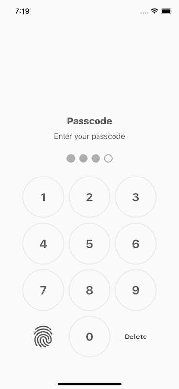
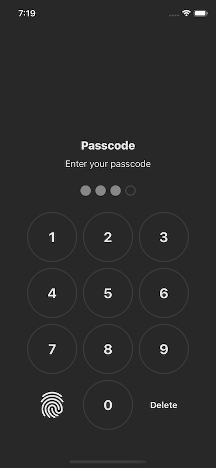

# Passcode

### A simple passcode screen to protect your app.

In order to present passcode modal screen, firstly conform your preffered storage with `PasscodeStorageProtocol`.

```swift
struct MySecureStorage { ... }

extension MySecureStorage: PasscodeStorageProtocol {

    public var passcode: String? {
        load(key: "myPasscodeKey")
    }
    
    public func save(passcode: String) {
        save(passcode, withKey: "myPasscodeKey")
    }
}
```
Then just use `present(using:)` like this

```swift
let mySecureStorage = MySecureStorage()
Passcode.present(using: mySecureStorage)
```

Passcode also support dark mode.



